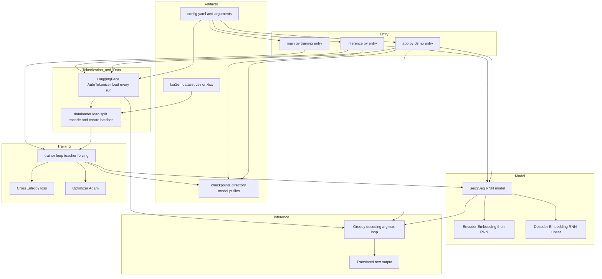

# 프로젝트 소개

RNN(Seq2Seq)으로 번역기를 만든다면 얼만큼 잘 번역할지 궁금해서 수행해본 프로젝트입니다.

RNN 구조를 기반으로 시작해서 Seq2Seq with Attention, Transformer 기반 번역기 세 가지 모두 구현하여 비교해보고, 인사이트를 정리하였습니다.

### 아키텍쳐




<br>

### 프로젝트 디렉터리 구조

```
root/
├── __init__.py
├── __pycache__/
├── app.py
├── config.yaml
├── dataloader.py
├── inference.py
├── kor2en.csv
├── kor2en.xlsx
├── main.py
├── model.py
├── note.py
├── README.md
├── trainer.py
└── utils.py
```

<br>

### 프로젝트 아키텍쳐


### 데이터셋 출처

[AI Hub](https://aihub.or.kr/aihubdata/data/dwld.do?currMenu=115&topMenu=100&dataSetSn=126)

<br>

---

# 인사이트 정리
