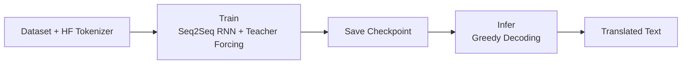

# 프로젝트 소개

### 프로젝트 취지
1. LLM을 사용하여 프로젝트를 수행하는것이 대세인 요즘, 한땀한땀 직접 찾아서 직접 구현하는것의 의미를 깨닫습니다. 단순히 결과가 나오는것에 집착하지 않고, 모든 과정을 완벽하게 설명할 수 있는것에 집중합니다.
2. NLP의 핵심인 Attention 이전까지 대세였던 RNN구조(Seq2Seq)가 Transformer구조에 비해 얼마나 성능이 떨어지는지 눈으로 직접 확인합니다.
3. RNN구조에서도 최대한 개선할 수 있는 부분을 개선한다면 어디까지 성능을 낼 수 있는지 고민해봅니다.

<br>
<br>

### 주요 개발 내용 및 결과
**1. 가장 기본적인 Seq2Seq(RNN)구조로 번역기를 구축**

토크나이저는 허깅페이스의 `klue/bert-base`, `google-bert/bert-base-uncased`를 사용하였으며, 그 외에 나머지 부분은 PyTorch를 통해 직접 구축하였습니다.

<br>

**2. 평가 지표 구축**

**문제**: 기본적인 Loss값이 존재하긴 하지만, NLP에서는 Loss값이 작다는 것이 곧 Task를 잘 푼다는것을 의미하지는 않습니다. 따라서 Loss가 아닌 특정 Task(현재는 Machine Translation Task)에 적합한 평가 지표를 구축하고, 이를 기반으로 고도화가 진행되어야 합니다.

**해결**: BLEU(Bilingual Evaluation Understudy)와 같은 평가 지표를 두고, 이를 기반으로 성능이 좋은 방향으로 기준을 잡습니다. → (왜 하필 BLEU인지?)

<br>

**3. Embedding Layer 바꾸기**

**문제**: 1단계에서의 Embedding Layer는 단순히 `torch.nn.Embedding(vocab_size, embedding_dim)`이였지만, `nn.Embedding`은 학습 단계에서 생각보다 잘 업데이트가 되지 않습니다. 따라서 Embedding을 만드는

**해결**:

<br>

**4. 디코딩 전략**

**문제**: 단순히 greedy 방식의 디코딩 전략보다는 더 좋은 디코딩 전략(가령, Beam Search등)이 존재합니다. 

<br>
<br>

### 최종 아키텍쳐


<br>
<br>

---

# 기타

### 프로젝트 디렉터리 구조
```
root/
├── __init__.py
├── app.py
├── config.yaml
├── dataloader.py
├── inference.py
├── kor2en.csv
├── kor2en.xlsx
├── main.py
├── model.py
├── note.py
├── README.md
├── trainer.py
└── utils.py
```

<br>

### 데이터셋 출처

[AI Hub](https://aihub.or.kr/aihubdata/data/dwld.do?currMenu=115&topMenu=100&dataSetSn=126)

